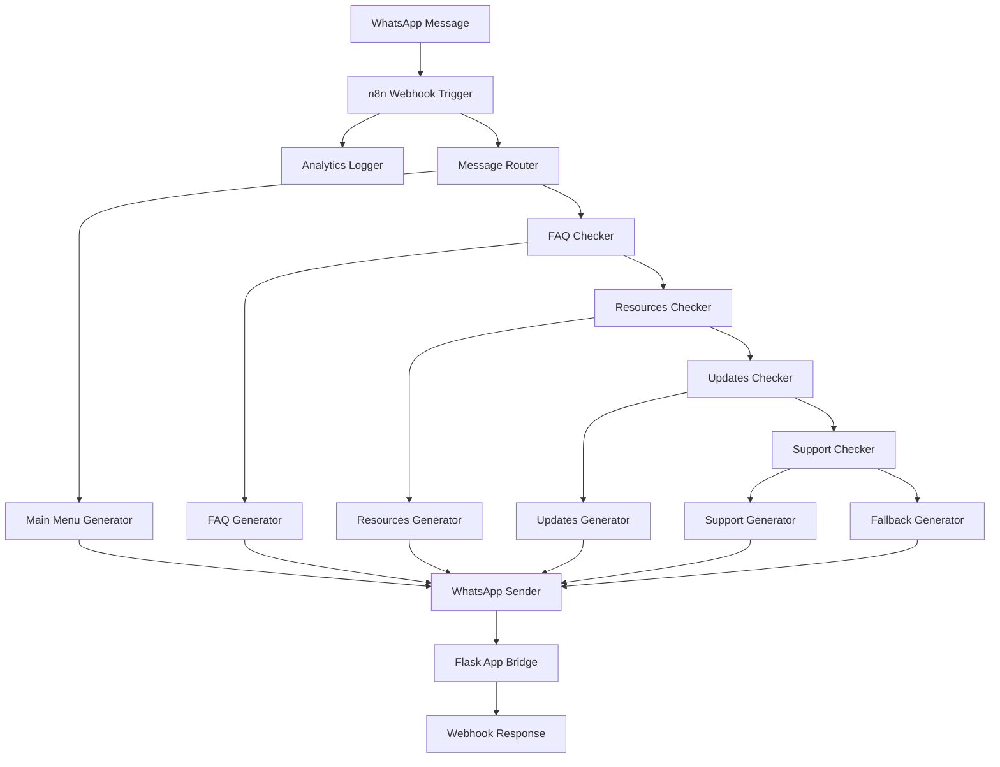

# n8n WhatsApp Education Bot Workflow

## Overview

This n8n workflow enhances your existing WhatsApp Education Bot by providing advanced automation, analytics, and message routing capabilities. The workflow integrates seamlessly with your Flask application while adding powerful features like message analytics, intelligent routing, and enhanced response generation.

## Features

### 🔄 **Intelligent Message Routing**
- Automatic categorization of incoming messages
- Smart routing based on message content
- Fallback handling for unrecognized queries

### 📊 **Message Analytics**
- Real-time message tracking and logging
- User interaction analytics
- Session management and reporting

### 🤖 **Enhanced Response Generation**
- Modular response handlers for different categories
- Dynamic content generation
- Consistent message formatting

### 🔗 **Flask App Integration**
- Seamless bridge to existing Flask application
- Maintains compatibility with current Twilio setup
- Dual-channel message processing

## Workflow Architecture



## Setup Instructions

### 1. Prerequisites

- n8n installed and running (self-hosted or cloud)
- Existing WhatsApp Education Bot Flask application
- WhatsApp Business API access (Meta/Facebook)
- ngrok (for local development)

### 2. n8n Installation

#### Option A: Docker (Recommended)
```bash
# Create n8n directory
mkdir n8n-data

# Run n8n with Docker
docker run -it --rm \
  --name n8n \
  -p 5678:5678 \
  -v ~/.n8n:/home/node/.n8n \
  n8nio/n8n
```

#### Option B: npm Installation
```bash
# Install n8n globally
npm install n8n -g

# Start n8n
n8n start
```

### 3. Import Workflow

1. Open n8n interface at `http://localhost:5678`
2. Click "+" to create new workflow
3. Click the three dots menu → "Import from file"
4. Select the `n8n-workflow.json` file from this project
5. Click "Import"

### 4. Configure Webhook URLs

#### Update Flask App (Optional Enhancement)
Add a new endpoint to your Flask app for n8n integration:

```python
@app.post("/n8n-webhook")
def n8n_webhook():
    """Endpoint specifically for n8n integration"""
    data = request.get_json()
    print(f"n8n Webhook received: {data}")
    return {"status": "received", "timestamp": datetime.now().isoformat()}
```

#### Configure Twilio Webhook
Instead of pointing directly to your Flask app, point Twilio webhook to n8n:

**Production Setup:**
- Twilio Webhook URL: `https://your-n8n-instance.com/webhook/n8n-whatsapp-webhook`

**Development Setup:**
- Start ngrok for n8n: `ngrok http 5678`
- Twilio Webhook URL: `https://your-ngrok-url.ngrok-free.app/webhook/n8n-whatsapp-webhook`

### 5. Environment Configuration

#### n8n Environment Variables
```bash
# Set these in your n8n environment
export WHATSAPP_ACCESS_TOKEN="your_whatsapp_access_token"
export WHATSAPP_PHONE_NUMBER_ID="your_phone_number_id"
export FLASK_APP_URL="http://localhost:5001"
```

#### Update WhatsApp Sender Node
In the n8n workflow, update the "WhatsApp Message Sender" node:

1. // Old: Direct WhatsApp Business API call
"WhatsApp Message Sender" → Meta API

// New: Twilio-compatible TwiML response
"Twilio TwiML Generator" → TwiML XML → Twilio webhook response
3. Configure authentication credentials in n8n

## Node Descriptions

### 🎯 **Webhook Trigger**
- **Purpose**: Receives incoming WhatsApp messages from Twilio
- **Configuration**: 
  - Path: `n8n-whatsapp-webhook`
  - Method: POST
  - Response Mode: Response Node

### 📊 **Analytics Logger**
- **Purpose**: Logs message analytics and user interaction data
- **Features**:
  - Message categorization
  - User session tracking
  - Timestamp logging
  - Console output for debugging

### 🔀 **Message Router**
- **Purpose**: Routes messages based on content analysis
- **Logic**: Checks for greeting keywords and routes accordingly

### 🎯 **Conditional Checkers**
- **FAQ Checker**: Identifies FAQ-related queries
- **Resources Checker**: Detects academic resource requests
- **Updates Checker**: Recognizes personalized update requests
- **Support Checker**: Handles support and contact queries

### 💬 **Response Generators**
- **Main Menu Generator**: Creates welcome menu
- **FAQ Generator**: Generates FAQ responses
- **Resources Generator**: Provides academic resource information
- **Updates Generator**: Delivers personalized updates
- **Support Generator**: Offers contact and support information
- **Fallback Generator**: Handles unrecognized queries

### 📤 **WhatsApp Sender**
- **Purpose**: Sends responses back to WhatsApp users
- **Configuration**: Uses WhatsApp Business API
- **Features**: 
  - Automatic recipient detection
  - Message formatting
  - Error handling

### 🌉 **Flask App Bridge**
- **Purpose**: Maintains integration with existing Flask application
- **Benefits**:
  - Preserves existing functionality
  - Enables gradual migration
  - Provides backup processing

## Message Flow Examples

### Example 1: Greeting Message
```
User: "Hi"
↓
Webhook Trigger → Analytics Logger → Message Router
↓
Main Menu Generator → WhatsApp Sender
↓
User receives: Welcome menu with options
```

### Example 2: FAQ Query
```
User: "fees"
↓
Webhook Trigger → Analytics Logger → Message Router → FAQ Checker
↓
FAQ Generator → WhatsApp Sender
↓
User receives: Fee structure information
```

### Example 3: Resource Request
```
User: "notes"
↓
Webhook Trigger → Analytics Logger → Message Router → FAQ Checker → Resources Checker
↓
Resources Generator → WhatsApp Sender
↓
User receives: Study notes information
```

## Analytics and Monitoring

### Analytics Data Structure
```json
{
  "timestamp": "2025-08-25T12:00:00.000Z",
  "fromNumber": "whatsapp:+1234567890",
  "messageBody": "fees",
  "category": "faq",
  "messageLength": 4,
  "sessionId": "+1234567890-Mon Aug 25 2025"
}
```

### Monitoring Dashboard
Access analytics through:
- n8n execution logs
- Browser console output
- External analytics tools (can be integrated)

## Advanced Features

### 1. Multi-language Support
Add language detection and response generation:

```javascript
// Add to any response generator
const language = detectLanguage(message);
const responses = {
  'en': 'English response',
  'es': 'Spanish response',
  'fr': 'French response'
};
return responses[language] || responses['en'];
```

### 2. Database Integration
Connect to databases for persistent storage:

```javascript
// Add database nodes between generators and sender
// Store user preferences, conversation history, analytics
```

### 3. AI/NLP Enhancement
Integrate with AI services:

```javascript
// Add OpenAI or other AI nodes for natural language processing
// Enhance message understanding and response generation
```

## Troubleshooting

### Common Issues

#### 1. Webhook Not Receiving Messages
- Check ngrok is running and accessible
- Verify Twilio webhook URL configuration
- Ensure n8n is listening on correct port

#### 2. WhatsApp Sender Errors
- Verify access token is valid
- Check phone number ID configuration
- Ensure proper authentication setup

#### 3. Flask Bridge Fails
- Confirm Flask app is running on port 5001
- Check network connectivity
- Verify endpoint URLs

### Debug Tips

1. **Enable n8n Debug Mode**:
   ```bash
   export N8N_LOG_LEVEL=debug
   n8n start
   ```

2. **Monitor Execution Logs**:
   - Check n8n execution history
   - Review node outputs
   - Monitor console logs

3. **Test Individual Nodes**:
   - Use manual triggers
   - Test with sample data
   - Validate node configurations

## Deployment

### Production Deployment

#### 1. n8n Cloud
- Sign up for n8n Cloud account
- Import workflow
- Configure environment variables
- Update webhook URLs

#### 2. Self-hosted n8n
```bash
# Production Docker setup
docker run -d \
  --name n8n \
  -p 5678:5678 \
  -e N8N_HOST="your-domain.com" \
  -e N8N_PORT=5678 \
  -e N8N_PROTOCOL=https \
  -e WEBHOOK_URL="https://your-domain.com" \
  -v ~/.n8n:/home/node/.n8n \
  n8nio/n8n
```

#### 3. Environment Variables
```bash
# Production environment
export WHATSAPP_ACCESS_TOKEN="your_production_token"
export WHATSAPP_PHONE_NUMBER_ID="your_production_phone_id"
export FLASK_APP_URL="https://your-flask-app.com"
export N8N_BASIC_AUTH_ACTIVE=true
export N8N_BASIC_AUTH_USER="admin"
export N8N_BASIC_AUTH_PASSWORD="secure_password"
```

## Security Considerations

### 1. Authentication
- Enable n8n basic authentication
- Use HTTPS for all endpoints
- Secure webhook URLs

### 2. Token Management
- Store tokens securely
- Rotate access tokens regularly
- Use environment variables

### 3. Data Privacy
- Implement data retention policies
- Anonymize user data
- Comply with privacy regulations

## Future Enhancements

### 1. Advanced Analytics
- User behavior analysis
- Conversation flow optimization
- Performance metrics dashboard

### 2. AI Integration
- Natural language processing
- Intelligent response generation
- Sentiment analysis

### 3. Multi-channel Support
- Telegram integration
- Discord bot
- Slack integration

### 4. Database Integration
- User profile management
- Conversation history
- Analytics storage

## Support

For issues and questions:
- Check n8n documentation: https://docs.n8n.io/
- Review workflow logs in n8n interface
- Consult Twilio WhatsApp API documentation
- Monitor Flask application logs

## License

This n8n workflow is designed to integrate with your existing WhatsApp Education Bot project and follows the same licensing terms.