# n8n Workflow Visual Architecture

## Complete Workflow Diagram

```mermaid
graph TD
    A[📱 WhatsApp User] -->|sends message| B[🔗 Twilio API]
    B -->|webhook POST| C[🎯 n8n Webhook Trigger]
    
    C --> D[📊 Analytics Logger]
    C --> E[🔀 Message Router]
    
    D -->|logs data| D1[📋 Console Output]
    
    E -->|greeting detected| F[🎉 Main Menu Generator]
    E -->|other messages| G[❓ FAQ Checker]
    
    G -->|FAQ keywords| H[📚 FAQ Generator]
    G -->|no FAQ match| I[📖 Resources Checker]
    
    I -->|resource keywords| J[🎓 Resources Generator]
    I -->|no resource match| K[📅 Updates Checker]
    
    K -->|update keywords| L[📝 Updates Generator]
    K -->|no update match| M[🆘 Support Checker]
    
    M -->|support keywords| N[📞 Support Generator]
    M -->|no support match| O[🤷 Fallback Generator]
    
    F --> P[📤 WhatsApp Sender]
    H --> P
    J --> P
    L --> P
    N --> P
    O --> P
    
    P -->|sends response| Q[🌉 Flask App Bridge]
    Q -->|backup processing| R[⚡ Flask App]
    Q --> S[✅ Webhook Response]
    
    S -->|response| B
    B -->|delivers message| A
    
    style A fill:#e1f5fe
    style B fill:#f3e5f5
    style C fill:#e8f5e8
    style D fill:#fff3e0
    style P fill:#fce4ec
    style S fill:#e8f5e8
```



## Message Flow by Category

### 1. Greeting Flow
```mermaid
graph LR
    A[User: "hi"] --> B[Message Router]
    B --> C[Main Menu Generator]
    C --> D[WhatsApp Sender]
    D --> E[Welcome Menu Sent]
    
    style A fill:#e3f2fd
    style E fill:#e8f5e8
```

### 2. FAQ Flow
```mermaid
graph LR
    A[User: "fees"] --> B[Message Router]
    B --> C[FAQ Checker]
    C --> D[FAQ Generator]
    D --> E[WhatsApp Sender]
    E --> F[Fee Info Sent]
    
    style A fill:#e3f2fd
    style F fill:#e8f5e8
```

### 3. Resources Flow
```mermaid
graph LR
    A[User: "notes"] --> B[Message Router]
    B --> C[FAQ Checker]
    C --> D[Resources Checker]
    D --> E[Resources Generator]
    E --> F[WhatsApp Sender]
    F --> G[Study Notes Info Sent]
    
    style A fill:#e3f2fd
    style G fill:#e8f5e8
```

### 4. Fallback Flow
```mermaid
graph LR
    A[User: "random text"] --> B[Message Router]
    B --> C[FAQ Checker]
    C --> D[Resources Checker]
    D --> E[Updates Checker]
    E --> F[Support Checker]
    F --> G[Fallback Generator]
    G --> H[WhatsApp Sender]
    H --> I[Help Message Sent]
    
    style A fill:#e3f2fd
    style I fill:#fff3e0
```

## Node Types and Functions

### 🎯 Trigger Nodes
- **Webhook Trigger**: Entry point for all WhatsApp messages
- **Manual Trigger**: For testing workflows manually

### 🔀 Logic Nodes
- **Message Router**: Primary routing based on greetings
- **FAQ Checker**: Checks for FAQ-related keywords
- **Resources Checker**: Identifies academic resource requests
- **Updates Checker**: Detects personalized update requests
- **Support Checker**: Handles support and contact queries

### 💻 Code Nodes
- **Analytics Logger**: JavaScript code for message analytics
- **Main Menu Generator**: Creates welcome menu response
- **FAQ Generator**: Generates FAQ responses from data
- **Resources Generator**: Provides academic resource information
- **Updates Generator**: Delivers personalized updates
- **Support Generator**: Offers contact and support information
- **Fallback Generator**: Handles unrecognized queries

### 🌐 HTTP Nodes
- **WhatsApp Sender**: Sends messages via WhatsApp Business API
- **Flask App Bridge**: Forwards requests to existing Flask app

### 📤 Response Nodes
- **Webhook Response**: Sends response back to Twilio

## Data Flow Architecture


## Integration Points

### 1. Twilio Integration


### 2. Flask App Integration


### 3. WhatsApp Business API Integration


## Deployment Architecture

### Development Setup


### Production Setup


## Performance and Scaling

### Message Processing Flow


### Scalability Considerations
- **Horizontal Scaling**: Multiple n8n instances
- **Database Integration**: Persistent storage for analytics
- **Caching**: Response caching for common queries
- **Load Balancing**: Distribute webhook requests
- **Queue Management**: Handle high-volume message bursts

This visual architecture helps understand the complete flow from user message to response delivery, showing how n8n enhances your existing WhatsApp Education Bot with advanced automation capabilities.