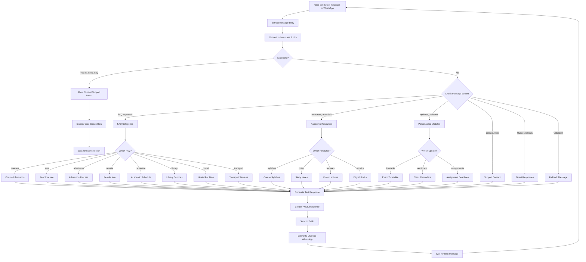
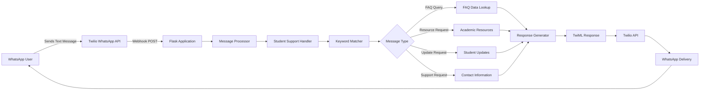
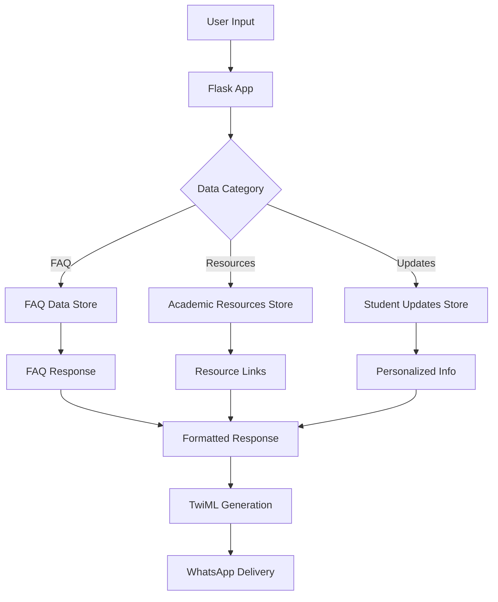
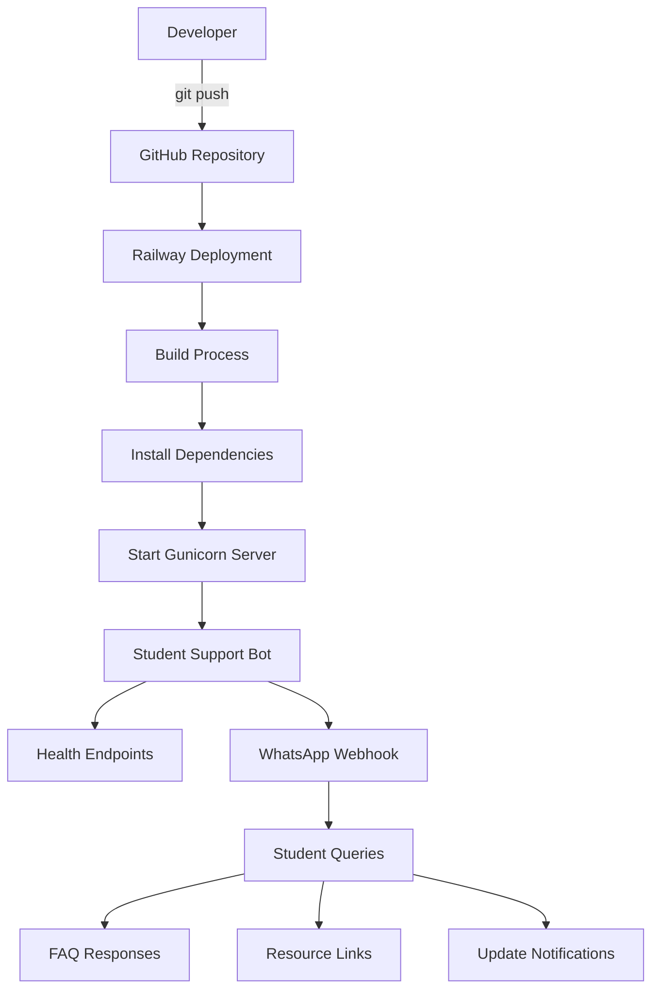

# WhatsApp Student Support Bot - System Flowcharts

## User Interaction Flow

```mermaid
flowchart TD
    A[User sends text message to WhatsApp] --> B[Extract message body]
    
    B --> C[Convert to lowercase & trim]
    C --> D{Is greeting?}
    
    D -->|Yes: hi, hello, hey| E[Show Student Support Menu]
    D -->|No| F{Check message content}
    
    E --> G[Display Core Capabilities]
    G --> H[Wait for user selection]
    
    F -->|FAQ keywords| I[FAQ Categories]
    F -->|resources, materials| J[Academic Resources]
    F -->|updates, personal| K[Personalized Updates]
    F -->|contact, help| L[Support Contact]
    F -->|Quick shortcuts| M[Direct Responses]
    F -->|Unknown| N[Fallback Message]
    
    I --> I1{Which FAQ?}
    I1 -->|courses| I2[Course Information]
    I1 -->|fees| I3[Fee Structure]
    I1 -->|admission| I4[Admission Process]
    I1 -->|results| I5[Results Info]
    I1 -->|schedule| I6[Academic Schedule]
    I1 -->|library| I7[Library Services]
    I1 -->|hostel| I8[Hostel Facilities]
    I1 -->|transport| I9[Transport Services]
    
    J --> J1{Which Resource?}
    J1 -->|syllabus| J2[Course Syllabus]
    J1 -->|notes| J3[Study Notes]
    J1 -->|lectures| J4[Video Lectures]
    J1 -->|ebooks| J5[Digital Books]
    
    K --> K1{Which Update?}
    K1 -->|timetable| K2[Exam Timetable]
    K1 -->|reminders| K3[Class Reminders]
    K1 -->|assignments| K4[Assignment Deadlines]
    
    I2 --> O[Generate Text Response]
    I3 --> O
    I4 --> O
    I5 --> O
    I6 --> O
    I7 --> O
    I8 --> O
    I9 --> O
    J2 --> O
    J3 --> O
    J4 --> O
    J5 --> O
    K2 --> O
    K3 --> O
    K4 --> O
    L --> O
    M --> O
    N --> O
    
    O --> P[Create TwiML Response]
    P --> Q[Send to Twilio]
    Q --> R[Deliver to User via WhatsApp]
    
    R --> S[Wait for next message]
    S --> A
```

## System Architecture Flow

```mermaid
flowchart LR
    A[WhatsApp User] -->|Sends Text Message| B[Twilio WhatsApp API]
    B -->|Webhook POST| C[Flask Application]
    
    C --> D[Message Processor]
    D --> E[Student Support Handler]
    
    E --> F[Keyword Matcher]
    F --> G{Message Type}
    
    G -->|FAQ Query| H[FAQ Data Lookup]
    G -->|Resource Request| I[Academic Resources]
    G -->|Update Request| J[Student Updates]
    G -->|Support Request| K[Contact Information]
    
    H --> L[Response Generator]
    I --> L
    J --> L
    K --> L
    
    L --> M[TwiML Response]
    M --> N[Twilio API]
    N --> O[WhatsApp Delivery]
    O --> A
```

## Data Structure Flow

```mermaid
flowchart TB
    A[User Input] --> B[Flask App]
    
    B --> C{Data Category}
    
    C -->|FAQ| D[FAQ Data Store]
    C -->|Resources| E[Academic Resources Store]
    C -->|Updates| F[Student Updates Store]
    
    D --> G[FAQ Response]
    E --> H[Resource Links]
    F --> I[Personalized Info]
    
    G --> J[Formatted Response]
    H --> J
    I --> J
    
    J --> K[TwiML Generation]
    K --> L[WhatsApp Delivery]
```

## Deployment Flow

```mermaid
flowchart TD
    A[Developer] -->|git push| B[GitHub Repository]
    B --> C[Railway Deployment]
    
    C --> D[Build Process]
    D --> E[Install Dependencies]
    E --> F[Start Gunicorn Server]
    F --> G[Student Support Bot]
    
    G --> H[Health Endpoints]
    G --> I[WhatsApp Webhook]
    
    I --> J[Student Queries]
    J --> K[FAQ Responses]
    J --> L[Resource Links]
    J --> M[Update Notifications]
```