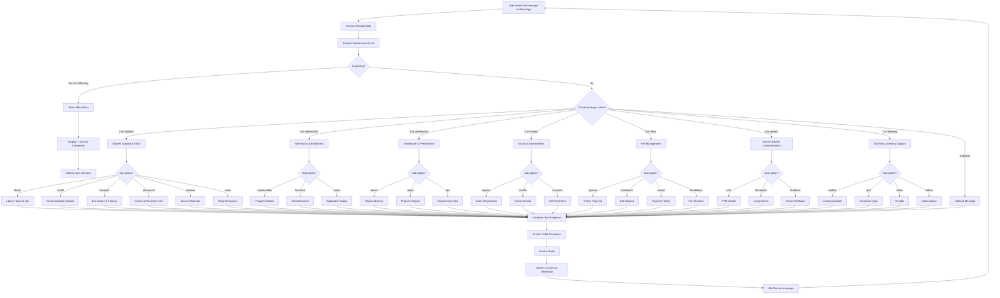
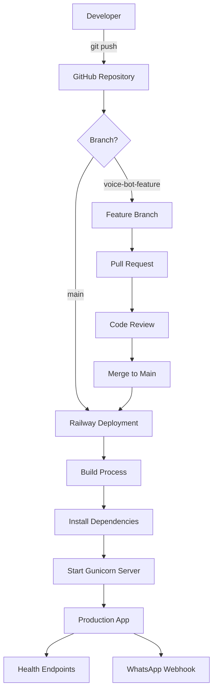

# WhatsApp Education Bot - System Flowchart

## Complete User Interaction Flow

```mermaid
flowchart TD
    A[User sends text message to WhatsApp] --> B[Extract message body]
    
    B --> C[Convert to lowercase & trim]
    C --> D{Is greeting?}
    
    D -->|Yes: hi, hello, hey| E[Show Main Menu]
    D -->|No| F{Check message content}
    
    E --> G[Display 7 Service Categories]
    G --> H[Wait for user selection]
    
    F -->|1 or 'student'| I[Student Support & FAQs]
    F -->|2 or 'admissions'| J[Admissions & Enrollment]
    F -->|3 or 'attendance'| K[Attendance & Performance]
    F -->|4 or 'exams'| L[Exams & Assessments]
    F -->|5 or 'fees'| M[Fee Management]
    F -->|6 or 'parent'| N[Parent-Teacher Communication]
    F -->|7 or 'learning'| O[EdTech & Learning Support]
    F -->|Unknown| P[Fallback Message]
    
    I --> I1{Sub-option?}
    I1 -->|library| I2[Library Hours & Info]
    I1 -->|hostel| I3[Accommodation Details]
    I1 -->|transport| I4[Bus Routes & Timings]
    I1 -->|placement| I5[Career & Placement Info]
    I1 -->|syllabus| I6[Course Materials]
    I1 -->|notes| I7[Study Resources]
    
    J --> J1{Sub-option?}
    J1 -->|mba/bca/bba| J2[Program Details]
    J1 -->|brochure| J3[Send Brochure]
    J1 -->|status| J4[Application Status]
    
    K --> K1{Sub-option?}
    K1 -->|absent| K2[Report Absence]
    K1 -->|report| K3[Progress Report]
    K1 -->|tips| K4[Improvement Tips]
    
    L --> L1{Sub-option?}
    L1 -->|register| L2[Exam Registration]
    L1 -->|results| L3[Check Results]
    L1 -->|reminder| L4[Set Reminders]
    
    M --> M1{Sub-option?}
    M1 -->|paynow| M2[Online Payment]
    M1 -->|installment| M3[EMI Options]
    M1 -->|receipt| M4[Payment History]
    M1 -->|breakdown| M5[Fee Structure]
    
    N --> N1{Sub-option?}
    N1 -->|ptm| N2[PTM Details]
    N1 -->|homework| N3[Assignments]
    N1 -->|feedback| N4[Share Feedback]
    
    O --> O1{Sub-option?}
    O1 -->|module| O2[Learning Module]
    O1 -->|quiz| O3[Interactive Quiz]
    O1 -->|doubt| O4[AI Q&A]
    O1 -->|videos| O5[Video Library]
    
    I2 --> Q[Generate Text Response]
    I3 --> Q
    I4 --> Q
    I5 --> Q
    I6 --> Q
    I7 --> Q
    J2 --> Q
    J3 --> Q
    J4 --> Q
    K2 --> Q
    K3 --> Q
    K4 --> Q
    L2 --> Q
    L3 --> Q
    L4 --> Q
    M2 --> Q
    M3 --> Q
    M4 --> Q
    M5 --> Q
    N2 --> Q
    N3 --> Q
    N4 --> Q
    O2 --> Q
    O3 --> Q
    O4 --> Q
    O5 --> Q
    P --> Q
    
    Q --> R[Create TwiML Response]
    R --> S[Send to Twilio]
    S --> T[Deliver to User via WhatsApp]
    
    T --> U[Wait for next message]
    U --> A
```

## System Architecture Flow

```mermaid
flowchart LR
    A[WhatsApp User] -->|Sends Text Message| B[Twilio WhatsApp API]
    B -->|Webhook POST| C[Flask Application]
    
    C --> D[Message Processor]
    D --> E[Text Handler]
    
    E --> F[Command Matcher]
    F --> G[Response Generator]
    
    G --> H[Text Response]
    H --> I[TwiML Response]
    
    I --> J[Twilio API]
    J --> K[WhatsApp Delivery]
    K --> A
```

## Deployment Flow

```mermaid
flowchart TD
    A[Developer] -->|git push| B[GitHub Repository]
    B --> C{Branch?}
    
    C -->|main| D[Railway Deployment]
    C -->|voice-bot-feature| E[Feature Branch]
    
    D --> F[Build Process]
    F --> G[Install Dependencies]
    G --> H[Start Gunicorn Server]
    H --> I[Production App]
    
    I --> J[Health Endpoints]
    I --> K[WhatsApp Webhook]
    
    E --> L[Pull Request]
    L --> M[Code Review]
    M --> N[Merge to Main]
    N --> D
```