# WhatsApp Student Support Bot - Comprehensive System Flowcharts

## User Interaction Flow

```mermaid
flowchart TD
    A[User sends WhatsApp message] --> B[Extract message body]
    
    B --> C[Convert to lowercase & trim]
    C --> D{Message Type?}
    
    D -->|hi, hello, hey, start, menu| E[Show Student Support Menu]
    D -->|FAQ keywords| F[FAQ Response System]
    D -->|resources, materials, study| G[Academic Resources Menu]
    D -->|updates, personal, my| H[Personalized Updates Menu]
    D -->|contact, support, help| I[Support Contact Info]
    D -->|Quick shortcuts| J[Direct FAQ Responses]
    D -->|Unknown message| K[Fallback Help Message]
    
    E --> L[Display Main Menu with:<br/>• FAQs: courses, fees, admission, results, schedule<br/>• Resources: syllabus, notes, lectures, ebooks<br/>• Updates: timetable, reminders, assignments<br/>• Facilities: library, hostel, transport]
    
    F --> F1{Which FAQ?}
    F1 -->|courses| F2[📚 Available Courses Info]
    F1 -->|fees| F3[💰 Fee Structure Details]
    F1 -->|admission| F4[🎓 Admission Process Info]
    F1 -->|results| F5[📊 Results Information]
    F1 -->|schedule| F6[📅 Academic Schedule]
    F1 -->|library| F7[📚 Library Services & Hours]
    F1 -->|hostel| F8[🏠 Hostel Facilities Info]
    F1 -->|transport| F9[🚌 Transport Services]
    
    G --> G1{Which Resource?}
    G1 -->|syllabus| G2[📖 Course Syllabus & Materials]
    G1 -->|notes| G3[📝 Study Notes & Papers]
    G1 -->|lectures| G4[🎥 Recorded Video Lectures]
    G1 -->|ebooks| G5[📱 Digital Books & Journals]
    
    H --> H1{Which Update?}
    H1 -->|timetable| H2[📅 This Week's Exam Timetable]
    H1 -->|reminders| H3[🔔 Class & Event Reminders]
    H1 -->|assignments| H4[📝 Assignment Deadlines]
    
    J --> J1{Quick Shortcut?}
    J1 -->|fee, cost, price| J2[Direct to Fee Structure]
    J1 -->|course, program| J3[Direct to Courses Info]
    J1 -->|exam, test| J4[Direct to Exam Timetable]
    J1 -->|class, reminder| J5[Direct to Class Reminders]
    J1 -->|assignment, homework| J6[Direct to Assignment Deadlines]
    
    F2 --> M[Generate TwiML Response]
    F3 --> M
    F4 --> M
    F5 --> M
    F6 --> M
    F7 --> M
    F8 --> M
    F9 --> M
    G2 --> M
    G3 --> M
    G4 --> M
    G5 --> M
    H2 --> M
    H3 --> M
    H4 --> M
    I --> M
    J2 --> M
    J3 --> M
    J4 --> M
    J5 --> M
    J6 --> M
    K --> M
    L --> N[Wait for user selection]
    
    M --> O[Send TwiML to Twilio]
    O --> P[Deliver to User via WhatsApp]
    N --> Q[User sends next message]
    P --> Q
    Q --> A
```



## System Architecture Flow


## Deployment & Testing Flow

```mermaid
flowchart TD
    A[Developer] -->|git push| B[GitHub Repository]
    B --> C[Railway Auto-Deploy]
    
    C --> D[Build Process]
    D --> E[Install Dependencies from requirements.txt]
    E --> F[Start Gunicorn Server]
    F --> G[Production Student Support Bot]
    
    G --> H[Health Endpoints (/health)]
    G --> I[WhatsApp Webhook (/whatsapp)]
    
    subgraph "Local Development"
        J[Local Machine] --> K[Virtual Environment (.venv)]
        K --> L[Flask Development Server]
        L --> M[Port 5002]
        M --> N[ngrok Tunnel]
        N --> O[Public HTTPS URL]
    end
    
    subgraph "Testing Methods"
        P[Local Testing:<br/>curl localhost:5002/whatsapp]
        Q[Public Testing:<br/>curl -H 'ngrok-skip-browser-warning: true'<br/>ngrok-url/whatsapp]
        R[WhatsApp Integration:<br/>Twilio Webhook Configuration]
    end
    
    I --> S[Student Queries]
    S --> T[FAQ Responses]
    S --> U[Resource Links]
    S --> V[Update Notifications]
    S --> W[Support Information]
```

## Data Flow & Response Generation

```mermaid
flowchart TB
    A[Incoming WhatsApp Message] --> B[Flask /whatsapp Endpoint]
    
    B --> C[Extract Body Parameter]
    C --> D[Clean & Normalize Text]
    D --> E{Message Classification}
    
    E -->|Greeting Pattern| F[Main Menu Response]
    E -->|FAQ Pattern| G[FAQ Lookup]
    E -->|Resource Pattern| H[Resource Menu/Direct]
    E -->|Update Pattern| I[Update Menu/Direct]
    E -->|Support Pattern| J[Contact Information]
    E -->|Quick Shortcut| K[Direct Response]
    E -->|Unknown| L[Fallback Message]
    
    subgraph "Data Sources"
        M[faq_data Dictionary:<br/>8 categories with responses]
        N[academic_resources Dictionary:<br/>4 resource types with links]
        O[student_updates Dictionary:<br/>3 update types with info]
    end
    
    G --> M
    H --> N
    I --> O
    
    F --> P[Format Response]
    G --> P
    H --> P
    I --> P
    J --> P
    K --> P
    L --> P
    
    P --> Q[Generate TwiML XML]
    Q --> R[Return to Twilio]
    R --> S[Deliver via WhatsApp]
    
    subgraph "Response Examples"
        T["📚 Available Courses:<br/>• MBA (2 years)<br/>• BCA (3 years)<br/>📧 Details: courses@example.com"]
        U["📝 Study Notes:<br/>• Chapter-wise notes<br/>• Faculty materials<br/>🔗 Access: example.com/notes"]
        V["📅 Exam Timetable:<br/>• Monday: Mathematics<br/>• Wednesday: Science<br/>📍 Venue: Main Hall"]
    end
```



---

## Key Features Summary

### 🎯 **Supported Interactions**
- **Main Menu**: `hi`, `hello`, `hey`, `start`, `menu`
- **FAQ Categories**: `courses`, `fees`, `admission`, `results`, `schedule`, `library`, `hostel`, `transport`
- **Academic Resources**: `resources`, `syllabus`, `notes`, `lectures`, `ebooks`
- **Student Updates**: `updates`, `timetable`, `reminders`, `assignments`
- **Support**: `contact`, `support`, `help`
- **Quick Shortcuts**: Smart keyword recognition for natural queries

### 🔧 **Technical Architecture**
- **Framework**: Flask 3.0.3 with Python 3.9+
- **Messaging**: Twilio WhatsApp API with TwiML responses
- **Deployment**: Railway with Gunicorn WSGI server
- **Development**: Local testing with ngrok tunnel
- **Data**: In-memory dictionaries (easily extensible to databases)

### 📱 **Integration Ready**
- **Webhook Endpoint**: `/whatsapp` for Twilio integration
- **Health Check**: `/health` for monitoring
- **CORS Friendly**: Handles WhatsApp webhook requirements
- **Stateless Design**: No session management required